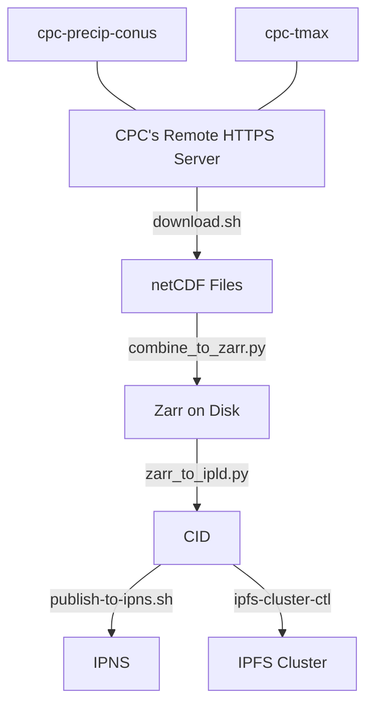

This repository contains scripts that compute and deploy ETLs for dClimate.

For:
+ **Dev environment setup, Writing ETLs** See `README-dev.md`
  + **Provider and dataset specific information** See the README.md inside that provider's directory (e.g. `cpc/README.md`)
+ **Running ETLs and deploying to IPFS** See `README-ops.md`
+ **Ensuring data access reliaibility and accuracy** See `README-monitoring.md`

Almost all scripts can be assumed to be **idempotent**. This means rerunning script and it will only change things if any of the underlying data has changed. Necessary exceptions have been made however, and are noted where possible.

# Project Organization Overview
These are the datasets we concerned with, under their larger overall groupings.
```
AGB
agb-quarterly

CHIRPS
chirps_final_05-daily
chirps_final_25-daily
chirps_prelim_05-daily

Copernicus
copernicus_ocean_salinity_0p5_meters-daily
copernicus_ocean_salinity_109_meters-daily
copernicus_ocean_salinity_1p5_meters-daily
copernicus_ocean_salinity_25_meters-daily
copernicus_ocean_salinity_2p6_meters-daily
copernicus_ocean_sea_level-daily
copernicus_ocean_temp_1p5_meters-daily
copernicus_ocean_temp_6p5_meters-daily

CPC
cpc_precip_global-daily
cpc_precip_us-daily
cpc_temp_max-daily
cpc_temp_min-daily

Deforestation
deforestation-quarterly

ERA5
era5_2m_temp-hourly
era5_land_precip-hourly
era5_land_surface_pressure-hourly
era5_precip-hourly
era5_surface_solar_radiation_downwards-hourly
era5_wind_100m_u-hourly
era5_wind_100m_v-hourly
era5_wind_10m_u-hourly
era5_wind_10m_v-hourly

PRISM
prism-precip-daily
prism-tmax-daily
prism-tmin-daily

VHI
vhi-weekly
```
You can see that there is a directory for each of these larger groupings, and every dataset has its own directory under those groupings. CPC is a good example to verify this.

Under each of those directories, there are also various files that correspond to the ETL operations.

# General ETL Steps
Using the CPC datasets as an example, these are the general steps that ETLs follow.


# Shell Requirements
Ensure the following are installed in the local environment.
+ `git`
+ `wget`
+ `uv` [https://github.com/astral-sh/uv](https://github.com/astral-sh/uv) for python packages and virtual environment creation.
+ `python` >= 3.10.14

# Setup python virtual environment
1. Use `uv` to instantiate the virtual environment and install packages
```sh
$ pwd
"..."/etl-scripts
$ uv venv
$ uv pip compile --all-extras pyproject.toml -o requirements.txt
$ uv pip sync requirements.txt
```
2. To activate the virtual environment:
```sh
$ source .venv/bin/activate
```
To deactivate once done working, just run
```sh
$ deactivate
```

# Install Commit Hooks
```sh
$ source .venv/bin/activate
(venv) $ pre-commit install
```

# Formatting and Linting
Just run the pre-commit hook using
```sh
pre-commit run --all-files
```
This will reformat all files, and lint them as well.

## Manually Formatting
```sh
$ ruff format
```
This command automatically reformats any files as needed. To only do a check, run `ruff format --check`

## Manually Linting
```sh
$ pwd
"..."/etl-scripts
$ ruff check
```

# Changing python requirements
## Add dependency
Pretend we are intalling the package `foo`.
1. Change `pyproject.toml` file.
```diff
diff --git a/pyproject.toml b/pyproject.toml
index 1234567..8901234 100644
--- a/pyproject.toml
+++ b/pyproject.toml
@@ -1,4 +1,5 @@
  dependencies = [
+    "foo",
      "ipldstore @ git+https://github.com/dClimate/ipldstore",
  ]
```
2. Now just rerun the steps to install packages. `uv` will automatically compute what to uninstall and reinstall for us.
```sh
$ uv pip compile --all-extras pyproject.toml -o requirements.txt
$ uv pip sync requirements.txt
```

## Remove a dependency
It's the same steps adding a dependency, after changing the `pyproject.toml` file, you rerun the steps to install packages.

# Run an ETL for: CPC
First, ensure an ipfs-cluster-ctl and ipfs daemon are running.
```sh
cd operations
sh pipeline-cpc.sh precip-conus
cat cpc/precip-conus/*.cid
```
The CIDs are stored as files in the directory created for each dataset from CPC once done.

# FAQ

WHY DOESN'T MY ZARR PARSE PROPERLY?!?!
- Try setting the time dimension to unlimited in the .nc file