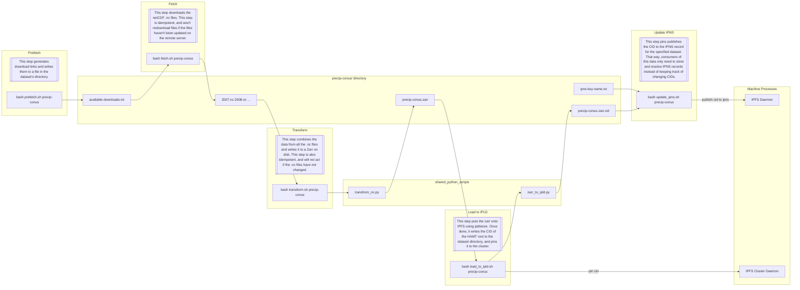

# Datasets
+ `precip-conus` Daily precipitation data for the continental United States. https://psl.noaa.gov/mddb2/showDataset.html?datasetID=45
+ `precip-global` Daily precipitation data for Earth. https://psl.noaa.gov/data/gridded/data.cpc.globalprecip.html
+ `tmax` Daily maximum temperature for Earth. https://psl.noaa.gov/data/gridded/data.cpc.globaltemp.html
+ `tmin` Daily minimum temperature for Earth. https://psl.noaa.gov/data/gridded/data.cpc.globaltemp.html

# ETL Diagram
The following is a an example of how the ETL for precip-conus runs. ETLs for the other 3 datasets run very similarly, so you can substitute `precip-conus/` in the diagram for one of the other datasets.

> [!NOTE]
> GitHub's mermaid diagram viewer elides nodes with long text, so will need to cross reference the mermaid source code in the markdown to see the descriptions for each step.

This can all be run automatically by calling `bash pipeline.sh <dataset>`.
