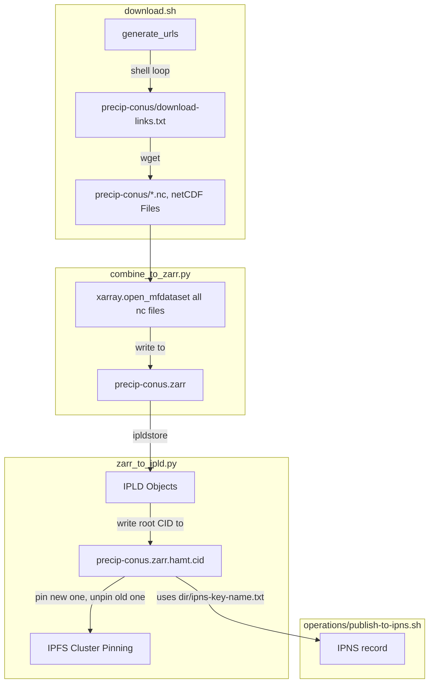

The steps for a CPC ETL:

```mermaid
graph

subgraph download.sh
generate_urls -->|shell loop| precip-conus/download-links.txt

nc["precip-conus/*.nc, netCDF Files"]
precip-conus/download-links.txt -->|wget| nc
end

subgraph combine_to_zarr.py
nc --> xarray["xarray.open_mfdataset all nc files"]
xarray -->|write to| zarr["precip-conus.zarr"]
end
subgraph zarr_to_ipld.py
zarr -->|ipldstore| IPLD["IPLD Objects"]
IPLD -->|write root CID to| CID["precip-conus.zarr.hamt.cid"]
CID -->|pin new one, unpin old one| cluster["IPFS Cluster Pinning"]
end
subgraph operations/publish-to-ipns.sh
CID -->|uses dir/ipns-key-name.txt| ipns["IPNS record"]
end
```

This can all be run automatically by a
