PRISM provides
For more info, always see the PRISM website: https://prism.oregonstate.edu/

# Datasets
In terms of grid precision, PRISM creates both 800 meter and 4 km versions. Only the 4 km versions are free however, so we ETL those. Hence also the 4km suffix at the end of the dataset directory names.

For more about getting higher resolution datasets see: https://prism.oregonstate.edu/orders/

As for the climate variables, we ETL precipitation `precip`, maximum temperature `tmax`, and minimum temperature `tmin`. We are only concerned with the daily versions of all of those. These all only cover the continental US.

+ `precip-4km`
+ `tmax-4km`
+ `tmin-4km`

# ETL Diagram
This is an overview of PRISM's ETL, using precip-4km as an example. The transform step is different than CPC and CHIRPS since PRISM provides a .nc file per day, with no time coordinate attached that we must create ourselves in xarray. Thus, there is a `transform_prism.py` file that imports a lot of functionality from `transform_nc.py`.

> [!NOTE]
> GitHub's mermaid diagram viewer cannot handle nodes with long text. This is why we have separated the mermaid diagram into `./etl-diagram.mmd`. To generate the svg yourself while editing documentation, use the [mermaid cli](https://github.com/mermaid-js/mermaid-cli) and run `mmdc -i etl-diagram.mmd -o etl-diagram.svg`.

# bil vs nc, and FTP vs HTTPS
PRISM provides both FTP and HTTPS services for retrieving their data.

The FTP service is unencrypted and provides data in the `bil` format.  You can browse the FTP directories using your browser here: https://ftp.prism.oregonstate.edu/

The HTTPS service allows for downloading in both bil and netCDF. This is why we chose the HTTPS service, as it removes a layer of complexity of converting from the bil format, and allows for encrypted file transfer, as opposed to the unencrypted FTP.
You can see more information about the HTTPS service here: https://prism.oregonstate.edu/documents/PRISM_downloads_web_service.pdf

## PRISM Grid Count
Files downloaded for a dataset are named `YYYY-MM-DD_N.nc`. The YYYY-MM-DD specifies the date the data corresponds to, N is PRISM's grid count. Grid count ranges from 1-8, with a 1 specifying completely new and 8 representing finalized. PRISM assigns a higher numbers when data has been more finalized.

See more about the grid count at https://prism.oregonstate.edu/documents/PRISM_update_schedule.pdf

## Data Bootstrapping
Doing a full download of the PRISM data takes a long time. Their documentation recommends at least a 2 second lapse in between web requests to not overload their servers. Thus, if you are downloading all data for even 1 variable, it will take approximately 13.4 hours. (If each download takes 1 second and you wait 2 seconds in between files).

To solve this issue, we periodically download and store a copy of netCDF files on IPFS. This is what `update-bootstrap.sh` does.

To pull down all the data files from the last saved bootstrap, we run `download-from-bootstrap.sh`. The `fetch.sh` script can then download only the files that have changed, resulting in a much shorter overall time to setup the ETLs.
